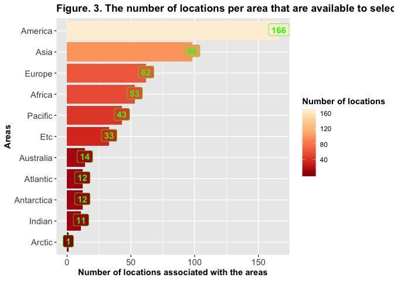

# _globalTimeConverter_: A simple Shiny application for converting times from one time zone to another
### Author: Preethy Nair
-   [1. Abstract](#abstract)
-   [2. Introduction](#introduction)
-   [3. Methods/Implementation](#methodsimplementation)
    -   [3.1 User interface](#user-interface)
        -   [3.1.1 Layout](#layout)
        -   [3.1.2 Input widgets](#input-widgets)
        -   [3.1.3 Output rendering](#output-rendering)
    -   [3.2. Server functions](#server-functions)
-   [4. Results and Discussion](#results-and-discussion)
-   [5. Conclusions](#conclusions)
-   [6. References](#references)

# 1. Abstract

Presented here is a simple and interactive web application,
`globalTimeConverter`, that converts times from one time zone to
another. With the help of drop-down menus on the sidebar, this
application lets users choose a date, a time, a `time zone` from which
to convert the time and a `time zone` to which to convert the time. The
time zones available for time conversions in this application are
provided in the conventional formats `Area/Location`, indicating a city
within an area, and `Etc/GMT±n`, with offsets of the time zones from
UTC. The time conversion results are automatically updated with the user
inputs and are displayed on the main and tab panels. In addition, a
short summary about the application and its usage is given in the main
panel, sidebar panel and under the documentation tab. The
`globalTimeConverter` is launched with default configured values to give
the users a preview of how the application works. The application is
freely available online at
[shinyapps.io](https://nairps.shinyapps.io/globaltimeconverter/) and can
be used by those with or without coding knowledge. `globalTimeConverter`
was developed in `R` with the help of `Shiny` and the source codes are
available from
[GitHub](https://github.com/nairps/data-science-specialisation-jhu/developing-data-products/globalTimeConverter/)
under MIT license. The documentation for the application is available
from the navigation tab,`Documentation`, presented on the top of the
page and and also through [GitHub
pages](https://nairps.github.io/data-science-specialisation-jhu/developing-data-products/globalTimeConverter/).
The users can also deploy the application locally on systems with `R`
and other dependencies installed by cloning the GitHub repository and
using the `R` command `shiny::runApp("~/globalTimeConverter")`, where
`~/globalTimeConverter` indicate absolute path to the application
repository. Alternatively, the application can also be launched using
the command
`shiny::runGitHub("data-science-specialisation-jhu", "nairps", subdir ="developing-data-products/globalTimeConverter")`.`globalTimeConverter`
can be helpful for scheduling collaborative meetings when members of an
organisation, e.g. multinational companies, from multiple time zones are
involved or for managing individual calendars to facilitate
participation in events/programs that are livecasted globally from other
parts of the world.

# 2. Introduction

The spectacular transformations in the information technology and
communication networks over the past few decades have revolutionized the
connectivity and strengthened the interactions between various parts of
the world \[1\], \[2\]. These rapid and innovative technological
developments have been a major driving factor for global internet
access, connectivity speed, the advent of streaming media, the ability
to distribute content in real-time, etc. These also enabled a vast
amount of events or programs across a wide range of domains such as
sports, weather, politics, local news, etc. to be live-streamed or
broadcasted live internationally across various time zones. For
instance, organizers of an increasing number of scientific,
technological, political, cultural, and business conferences, seminars,
meetings, etc. are ensuring higher rates of participation by providing
live access to a global audience from across the world.
Technology-driven advancements are also reflected in the education
sector; there had been tremendous growth in the number of entities,
including prestigious universities, from around the world offering
education services such as continuing education courses, specializations
and degrees to learners through online platforms.

Video-telephony is another critical technology that has emerged as a
powerful tool for assisting individuals or members of a global
organization to be in direct contact with each other in real-time.
Multinational business companies, hospitals, education sector \[3\],
\[4\], etc., have been relying on synchronous video-telephony services
where they have associated them with increased productivity and reduced
costs \[5\]–\[7\]. Consequently, collaborative working that involves
people from various time zones has become an increasingly common trend
nowadays. Thus, it has become inevitable under these circumstances to
organize regular meetings with collaborators who are located globally,
across multiple time zones. Time conversions are an integral part of
scheduling a meeting or a web conference when there is global
participation. Time conversions are also crucial for organizing
individual calendars for attending events that are shared instantly
around different time zones through live-streaming or live-broadcasting.

`globalTimeConverter`, a simple and interactive application, was
developed towards this end to help users all over the world to convert
times from one time zone to another for a day selected by the user. With
the help of input widgets, users can provide time, a date, a time zone
from which to convert the time from, and a preferred time zone to which
the time needs to be converted. The application automatically
re-evaluates the time conversion calculations with changes in the user
inputs and displays the updated time conversion results. This web
application is developed in `R` \[8\] using `Shiny` \[9\], an
open-source `R` package that provides a web framework for developing
applications. The application is freely available for online use at
[shinyapps.io](https://nairps.shinyapps.io/globaltimeconverter/) or can
be deployed for local use on operating systems with `R` and other
dependencies installed.

# 3. Methods/Implementation

The `globalTimeConverter`, a `shiny` based time zone converter
application entirely built using the `R` programming language, is
deployed on the web using shinyapps.io from RStudio \[10\]. The
implementation of this web application is dependent on many `R` packages
including `shiny` (Version 1.3.2) \[9\], `shinythemes` \[11\],
`tidyverse` \[12\], `shinyTimes` \[13\] and `DT` \[14\]. Furthermore,
some of the functions from the `lubridate` package \[15\], a widely used
package for handling dates and times in `R`, have been used here to
support operations involving time conversions.

All the components needed for running the application are included in
the directory named `globalTimeConverter`; the structure of the
application directory is illustrated in Figure 1. The global environment
for running the application is configured using an `R` script called
`global.R`. This makes sure that all the `R` packages that are required
for running the application are loaded into the global `R` environment
before the application starts. Besides, the time zone dataset to be
selected by the user for time conversions was processed, saved as `.RDS`
object and loaded into the global `R` environment using `global.R`. The
`R packages` that were loaded to the global `R` environment for this
application are presented in Figure 2. The user interface and server
functions of this application are defined separately in `ui.R` and
`server.R` to make the codes easier to read and manage. The technical
information regarding the user interface and server functions are
described in detail in the forthcoming sections.

**Figure 1. Structure of the application directory**

    ├── DESCRIPTION
    ├── data
    │   └── time_zones.RDS
    ├── doc_for_UI.md
    ├── global.R
    ├── index.md
    ├── index_files
    │   └── figure-markdown_strict
    │       └── figure1-1.png
    ├── main.md
    ├── notes.md
    ├── server.R
    ├── sidebar.md
    └── ui.R

**Figure 2. R dependencies**

    > sessionInfo()

    R version 3.6.1 (2019-07-05)

    attached base packages:
    [1] stats     graphics  grDevices utils     datasets  methods   base     

    other attached packages:
     [1] DT_0.13           forcats_0.4.0     stringr_1.4.0     dplyr_1.0.0       purrr_0.3.4      
     [6] readr_1.3.1       tidyr_1.1.0       tibble_2.1.3      ggplot2_3.2.1     tidyverse_1.2.1  
    [11] lubridate_1.7.4   shiny_1.3.2       shinythemes_1.1.2 shinyTime_1.0.1  

## 3.1 User interface

### 3.1.1 Layout

The user interface of the `globalTimeConverter` is designed using the
`Shiny` function `navbarPage` with the option `fluid` turned on. This
generates a responsive web-framework that can adjust to the dimensions
of the user's browser window. The layout is then specified by placing
the `title panel` element, which contains the application title, three
`tab panels` to be placed on the top of the page for navigation and the
`sidebarLayout` element within the `navbarPage`. The first `tab panel`
is the main application page; the second `tab panel`, `About`, provides
a summary on the application. The third tab panel, `Documentation`,
presents a detailed version of the documentation.

The `sidebarLayout` function generates a layout with a sidebar and the
main area. Typically, the user input widgets are arranged in the
sidebar, which by default appears on the left side, and the outputs are
displayed in the main area. For this application, a default layout is
created by defining the elements `sidebarPanel` and `mainPanel` within
the `sidebarLayout` and contents are then added to these panels. The
main panel of the user interface layout is segmented immediately after
the HTML output into two sections using the function `tabsetPanel`. The
function `tag` has been used in the `ui.R` and `server.R` for formatting
the input widgets, the output summary text and the HTML summary
displayed on the main panel. Further, a modified visual appearance was
provided to the app using the theme `flatly` from the `shinythemes`
package. \[11\].

### 3.1.2 Input widgets

Pre-built widgets from `shiny` \[9\] and `shinytime` \[13\] packages are
presented on the sidebar panel to facilitate user interactions. These
widgets let the users choose the time zone to convert from, the date,
the time to be converted, and the time zone to convert the time.

Here, the `selectInput()` function from `shiny` is used to display
drop-down menus for selecting the `from` and `to` time zones. The time
zone list (N=505) provided in the drop-down menus on the sidebar has
been generated based on `Olson-timezone-database` (ZoneInfo, TZDB or the
TZ database) Version `2017c` and was gathered from
[Wikipedia](https://en.wikipedia.org/wiki/List_of_tz_database_time_zones)
\[16\] on 2019-08-05. Of these, 85 of the time zones whose statuses were
indicated as "Deprecated" were eliminated, resulting in a total of 505
time zones in this application for time conversions. The time zones
collected from Wikipedia were tallied with the time zone list provided
by base `R` (version 3.6.1) from the Olson database (Version 2019a)
\[17\]. A total of 593 time zones were found from the base R using the
command `OlsonNames()`. All the time zones from the Time Zone Database
Version 2019a provided by the base `R` function `OlsonNames()` except
"Africa/Asmera", "Asia/Qostanay" and "Europe/Nicosia" were present in
the time zone list collected from Wikipedia on 2019-08-05. The processed
time zone data was saved as an `RDS` file in the `data` directory and
was loaded into the global environment using `global.R`.

Most time zones are listed in the preferred format `Area/Location`,
where a `location` represents a city or an island within the `Area`, a
continent or an ocean, as mentioned in the [TZ database
documentation](https://en.wikipedia.org/wiki/Tz_database). In addition,
time zones of the traditional format `Etc/GMT+n` and `Etc/GMT-n`
indicating offsets of the time zone from UTC (coordinated universal
time) are also included. Here, the negative offsets imply times ahead of
UTC and positive offsets indicate times behind the UTC.

Next, `dateInput()` function from `shiny` with default parameters is
used to present the user with a date input widget, which, when clicked,
brings up a calendar for the user to select dates. Similarly,
`timeInput()` function from the `shinytime` package is used to create an
input widget for the user to specify the time as hours \[0, 23\],
minutes \[0, 59\] and seconds \[0, 59\].

All the input widgets defined in the `ui.R` were provided an
`identifier` to make them accessible in the server function for
performing time conversion calculations. Further, to demonstrate the
application, all the input widgets have been configured with starting
values: time zone to be converted from is configured as *Europe/Zurich*,
the date is kept as *2020-08-17*, the time to be converted is configured
as *10:00:00* and the time zone to be converted is initialized as
*America/Phoenix*. Consequently, the application will be launched with
the time conversion output for these configured values displayed on the
main panel.

### 3.1.3 Output rendering

The main panel displays the reactive HTML summary for time conversion
using the HTML helper function `uiOutput()` from `shiny`. The main panel
is also segmented into two tab panels: the first tabpanel,
`Hourly time convertions for the day`, displays all the hourly times
(00:00:00 - 23:00:00) for the selected day converted to the time zone
user wanted to as an interactive table using the function
`dataTableOutput()`. Whereas, the second tabpanel, `Summary`, displays a
verbal statement for the time conversion as plain text using the
function `verbatimTextOutput` from `shiny`. All the output functions
defined in the `ui.R` are called with the names/identifiers of the
respective reactive `R` objects created using the `render*` functions in
the `server.R`. For the table in the tabpanel, the user can choose the
number of entries to be displayed on each page with the help of a select
box presented at the top left corner of the table. Further, the table
can be searched utilizing the control box at the top right corner and
can be filtered using the filter boxes constructed at the top of each
columns.

## 3.2. Server functions

`Shiny` applications use a reactive programming model with reactive
expressions that serve as reactive pathways to connect the input and the
output elements. The reactive expressions cache the results of their
calculations and are automatically re-evaluated when the input elements
from the widgets, on which they depend, vary.

The server function of a `shiny` application provides instructions for
building `R` objects that are converted to outputs using `shiny`
functions in the `ui.R` for displaying to the user interface. For the
`globalTimeConverter`, reactive expressions have been used in the server
function with the help of `Shiny` function `reactive()`. These
expressions are designed to access user inputs from the input widgets
and share them across the output functions. Altogether, three output
list elements are defined using `R` expressions inside the `render*()`
functions in the server script: a formatted HTML result, a data-table
and a summary text. All these output elements were provided ids/names
for accessing them from the `ui.R` for displaying the results.

# 4. Results and Discussion

The `globalTimeConverter` is developed using `R` programming language
into a web application framework with the help of `Shiny`. The
application is deployed on the cloud server and can be freely accessed
via the [shinyapp.io
account](https://nairps.shinyapps.io/globaltimeconverter/). By default,
the application is launched with a predefined set of values for time,
date and time zones to illustrate the application. The inputs can easily
be changed to user-defined values with input widgets provided on the
left sidebar panel of the application. The changes in the user inputs
are detected automatically and the time conversions are re-evaluated for
displaying the updated time conversions to the main and tab panels.

The source code for the application is freely available under MIT
license from the [GitHub
repository](https://github.com/nairps/data-science-specialisation-jhu/developing-data-products/globalTimeConverter/).
In addition to running this app online on the shiny server, the source
code can be cloned from
[GitHub](https://github.com/nairps/data-science-specialisation-jhu/developing-data-products/globalTimeConverter/)
and launched on systems with `R` version 3.6.1 and other dependencies
installed. To facilitate this, the `R packages` loaded to the global `R`
environment while running this application are listed in Figure 2. The
application can then be launched locally using the command
`shiny::runApp("~/globalTimeConverter")`, where, ~/globalTimeConverter
indicate the absolute path to the cloned repository. Other ways to
launch the application would be to use the GitHub repo name with the
shiny commands,
`shiny::runGitHub("data-science-specialisation-jhu", "nairps", subdir="globalTimeConverter")`,
or to use the URL of the GitHub repo with shiny commands,
`shiny::runUrl("https://github.com/nairps/data-science-specialisation-jhu/developing-data-products/globalTimeConverter//archive/master.tar.gz")`.
In both these cases, shiny downloads the application from the repo/URL
and runs the application on the local system.

It is worth noting here one of the limitations of this application. As
this application is hosted on the cloud using a free shinyapps.io
account, it is available only for up to a maximum time of 25 active
hours per month; this time is shared by other applications on the
author's account. A solution would be to launch the application locally
using `R`, after installing the required packages.

Taken together, the `globalTimeConverter`, is a simple, interactive,
time zone converter that can be used as a convenient tool for converting
times from and to user-defined time zones. The application can help
users across various time zones convert the schedules of interactive
live casts such as web seminars or conferences from a wide range of
domains, including sports, politics, technology, culture, education,
medicine, etc. to their local time zones facilitating remote
participation. This application can also be used for collaborative
purposes, for instance, to convert the times for online meetings when
individuals or members of an organization from various time zones are
involved.

# 5. Conclusions

The shiny application,`globalTimeConverter`, convert times from one time
zone to another; users can enter a time, a date, a time zone from which
to convert the time and a time zone to which to convert the time.
The application would be of great help for converting times and managing
personal calenders in the current situation with many onsite events
around the world formatted as virtual events with global participation.
The application's time conversions would also be of interest to the
global remote workforce for intra or inter-organizational
collaborations. The application is user friendly and is launched with
default inputs, demonstrating one example run of time zone conversion.
User-defined inputs can be provided via widgets on the sidebar and the
time zone conversions are automatically updated with changes in the user
inputs. The application is freely available to use online at
[shinyapps.io](https://nairps.shinyapps.io/globaltimeconverter/) and can
be used by non-technical users or users with coding knowledge.
`globalTimeConverter` is written in `R` and the source codes of the
application are available under MIT license from
[GitHub](https://github.com/nairps/data-science-specialisation-jhu/developing-data-products/globalTimeConverter/).
The application can also be deployed locally using source codes from
[the GitHub
repo](https://github.com/nairps/data-science-specialisation-jhu/developing-data-products/globalTimeConverter/),
provided, all the `R` dependencies are installed beforehand.

# 6. References

\[1\] I. T. U. International Telecommunications Union (Geneva), “Global
ICT developments, 2001-2018,” *ITU Statistics*..

\[2\] I. T. U. International Telecommunications Union (Geneva),
“Percentage of Individuals using the Internet 2000-2018.”.

\[3\] D. A. Ellingson and M. Notbohm, “Synchronous Distance Education:
Using Web-Conferencing in an MBA Accounting Course,” *American Journal
of Business Education*, vol. 5, no. 5, pp. 555–562, 2012.

\[4\] D. J. Faulds, “Overcoming Geographical Obstacles: The Use of Skype
in a Graduate-Level Social Media and Marketing Course,” *American
Journal of Business Education (AJBE)*, vol. 8, no. 2, pp. 79–94, Mar.
2015.

\[5\] A. Grimes, C. Ren, and P. Stevens, “The need for speed: Impacts of
internet connectivity on firm productivity,” *Journal of Productivity
Analysis*, vol. 37, no. 2, pp. 187–201, Apr. 2012.

\[6\] E. Curry, B. Guyon, C. Sheridan, and B. Donnellan, “Developing a
Sustainable IT Capability: Lessons From Intel’s Journey,” *MIS Quarterly
Executive*, vol. 11, 2012.

\[7\] M. Martin-Khan, F. Fatehi, M. Kezilas, K. Lucas, L. C. Gray, and
A. C. Smith, “Establishing a centralised telehealth service increases
telehealth activity at a tertiary hospital,” *BMC health services
research*, vol. 15, p. 534, Dec. 2015.

\[8\] R Core Team, *R: A Language and Environment for Statistical
Computing*. Vienna, Austria: R Foundation for Statistical Computing,
2019.

\[9\] W. Chang, J. Cheng, J. J. Allaire, Y. Xie, and J. McPherson,
*Shiny: Web Application Framework for R*. 2019.

\[10\] RStudio Team, *RStudio: Integrated Development Environment for
R*. Boston, MA: RStudio, Inc., 2016.

\[11\] W. Chang, *Shinythemes: Themes for Shiny*. 2018.

\[12\] H. Wickham, *Tidyverse: Easily Install and Load the ’Tidyverse’*.
2017.

\[13\] G. Burger, *shinyTime: A Time Input Widget for Shiny*. 2019.

\[14\] Y. Xie, J. Cheng, and X. Tan, *DT: A Wrapper of the JavaScript
Library ’DataTables’*. 2019.

\[15\] G. Grolemund and H. Wickham, “Dates and Times Made Easy with
**lubridate**,” *Journal of Statistical Software*, vol. 40, no. 3, pp.
1–25, 2011.

\[16\] E. Wikipedia, “List of tz database time zones.”.

\[17\] E. Paul, A. D. Olson, and I. The Internet Assigned Numbers
Authority, “Time Zone Database.”.
